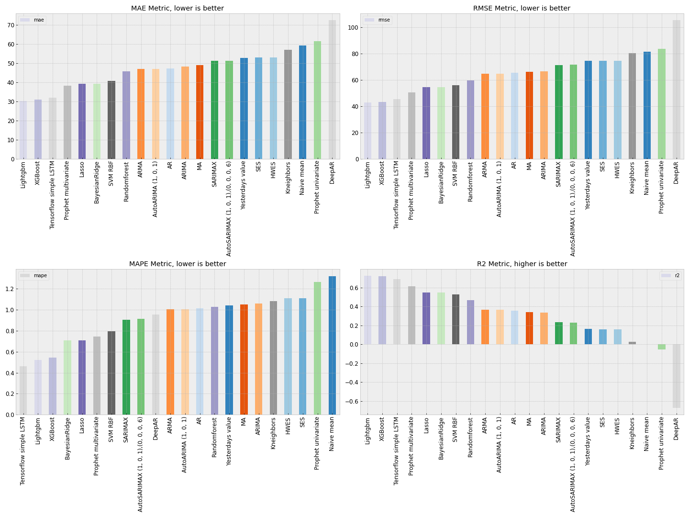

# :hourglass_flowing_sand: time-series-forecasting-wiki
This repository contains a series of analysis, transforms and forecasting models frequently used when dealing with time series. The aim of this repository is to showcase how to model time series from the scratch, for this we are using a real usecase dataset ([Beijing air polution dataset](https://archive.ics.uci.edu/ml/datasets/Beijing+PM2.5+Data) to avoid perfect use cases far from reality that are often present in this types of tutorials. If you want to rerun the notebooks make sure you install al neccesary dependencies, [Guide](docs/setup.md)

A simplified table of contents is:

#PLACEHOLDER

You can find the more detailed toc on the main notebook #LINK

**Who is this tutorial aimed to or prerequisites**

##TOFILL 

# :open_file_folder: Dataset

The dataset used is the [Beijing air quality](https://archive.ics.uci.edu/ml/datasets/Beijing+PM2.5+Data) public dataset. This dataset contains polution data from 2014 to 2019 sampled every 10 minutes along with extra weather features such as preassure, temperature etc. We decided to resample the dataset with daily frequency for both easier data handling and proximity to a real use case scenario (no one would build a model to predict polution 10 minutes ahead, 1 day ahead looks more realistic). In this case the series is already stationary with some small seasonalities which change every year #MORE ONTHIS

In order to obtain a exact copy of the dataset used in this tutorial please run the [script](https://github.com/jiwidi/time-series-forecasting-wiki/blob/master/datasets/download_datasets.py) under `datasets/download_datasets.py` which will automatically download the dataset and preprocess it for you.

#  📚 Analysis and transforms

* Time series decomposition
  * Level
  * Trend
  * Seasonality 
  * Noise
  
* Stationarity
  * AC and PAC plots
  * Rolling mean and std
  * Dickey-Fuller test
  
* Making our time series stationary
  * Difference transform
  * Log scale
  * Smoothing
  * Moving average

# :triangular_ruler: Models tested

* Autoregression ([AR](https://www.statsmodels.org/stable/generated/statsmodels.tsa.ar_model.AR.html))
* Moving Average (MA)
* Autoregressive Moving Average (ARMA)
* Autoregressive integraded moving average (ARIMA)
* Seasonal autoregressive integrated moving average (SARIMA)
* Bayesian regression [Link](https://scikit-learn.org/stable/auto_examples/linear_model/plot_bayesian_ridge.html)
* Lasso [Link](https://scikit-learn.org/stable/modules/generated/sklearn.linear_model.Lasso.html)
* SVM [Link](https://scikit-learn.org/stable/modules/classes.html?highlight=svm#module-sklearn.svm)
* Randomforest [Link](https://scikit-learn.org/stable/modules/generated/sklearn.ensemble.RandomForestRegressor.html?highlight=randomforest#sklearn.ensemble.RandomForestRegressor)
* Nearest neighbors [Link](https://scikit-learn.org/stable/modules/neighbors.html)
* XGBoost [Link](https://xgboost.readthedocs.io/en/latest/)
* Lightgbm [Link](https://github.com/microsoft/LightGBM)
* Prophet [Link](https://facebook.github.io/prophet/docs/quick_start.html)
* Long short-term memory with tensorflow (LSTM)[Link](https://www.tensorflow.org/)
* DeepAR

# :mag: Forecasting results
We will devide our results wether the extra features columns such as temperature or preassure were used by the model as this is a huge step in metrics and represents two different scenarios. Metrics used were:

## Evaluation Metrics
* Mean Absolute Error (MAE) 
* Mean Absolute Percentage Error (MAPE)
* Root Mean Squared Error (RMSE)
* Coefficient of determination (R2)

<table border="1" class="dataframe">
  <thead>
    <tr style="text-align: right;">
      <th></th>
      <th>mae</th>
      <th>rmse</th>
      <th>mape</th>
      <th>r2</th>
    </tr>
  </thead>
  <tbody>
    <tr>
      <th>EnsembleXG+TF</th>
      <td>27.960503</td>
      <td>39.686824</td>
      <td>0.438655</td>
      <td>0.762551</td>
    </tr>
    <tr>
      <th>EnsembleLIGHT+TF</th>
      <td>27.909784</td>
      <td>39.750590</td>
      <td>0.435101</td>
      <td>0.761787</td>
    </tr>
    <tr>
      <th>EnsembleXG+LIGHT+TF</th>
      <td>27.763722</td>
      <td>39.346366</td>
      <td>0.451024</td>
      <td>0.766607</td>
    </tr>
    <tr>
      <th>EnsembleXG+LIGHT</th>
      <td>29.614893</td>
      <td>41.660260</td>
      <td>0.520180</td>
      <td>0.738349</td>
    </tr>
    <tr>
      <th>Randomforest tunned</th>
      <td>40.740963</td>
      <td>53.151506</td>
      <td>0.903182</td>
      <td>0.574099</td>
    </tr>
    <tr>
      <th>SVM RBF GRID SEARCH</th>
      <td>38.565602</td>
      <td>50.340027</td>
      <td>0.776779</td>
      <td>0.617963</td>
    </tr>
    <tr>
      <th>DeepAR</th>
      <td>72.528734</td>
      <td>105.391313</td>
      <td>0.957377</td>
      <td>-0.674509</td>
    </tr>
    <tr>
      <th>Tensorflow simple LSTM</th>
      <td>31.406890</td>
      <td>44.007715</td>
      <td>0.466331</td>
      <td>0.708032</td>
    </tr>
    <tr>
      <th>Prophet multivariate</th>
      <td>38.346791</td>
      <td>50.502186</td>
      <td>0.744734</td>
      <td>0.615498</td>
    </tr>
    <tr>
      <th>Kneighbors</th>
      <td>57.048847</td>
      <td>80.387336</td>
      <td>1.082936</td>
      <td>0.025789</td>
    </tr>
    <tr>
      <th>SVM RBF</th>
      <td>40.808894</td>
      <td>56.032800</td>
      <td>0.794224</td>
      <td>0.526672</td>
    </tr>
    <tr>
      <th>Lightgbm</th>
      <td>30.173660</td>
      <td>42.745285</td>
      <td>0.522338</td>
      <td>0.724543</td>
    </tr>
    <tr>
      <th>XGBoost</th>
      <td>31.043099</td>
      <td>43.195546</td>
      <td>0.542145</td>
      <td>0.718709</td>
    </tr>
    <tr>
      <th>Randomforest</th>
      <td>45.837942</td>
      <td>59.448943</td>
      <td>1.029276</td>
      <td>0.467198</td>
    </tr>
    <tr>
      <th>Lasso</th>
      <td>39.236966</td>
      <td>54.583998</td>
      <td>0.709031</td>
      <td>0.550832</td>
    </tr>
    <tr>
      <th>BayesianRidge</th>
      <td>39.243001</td>
      <td>54.634477</td>
      <td>0.707874</td>
      <td>0.550001</td>
    </tr>
    <tr>
      <th>Prophet univariate</th>
      <td>61.533802</td>
      <td>83.646732</td>
      <td>1.268213</td>
      <td>-0.054814</td>
    </tr>
    <tr>
      <th>AutoSARIMAX (1, 0, 1),(0, 0, 0, 6)</th>
      <td>51.291983</td>
      <td>71.486838</td>
      <td>0.912563</td>
      <td>0.229575</td>
    </tr>
    <tr>
      <th>SARIMAX</th>
      <td>51.250482</td>
      <td>71.328643</td>
      <td>0.905278</td>
      <td>0.232981</td>
    </tr>
    <tr>
      <th>AutoARIMA (1, 0, 1)</th>
      <td>47.096859</td>
      <td>64.861693</td>
      <td>1.005644</td>
      <td>0.365759</td>
    </tr>
    <tr>
      <th>ARIMA</th>
      <td>48.249243</td>
      <td>66.387526</td>
      <td>1.061672</td>
      <td>0.335567</td>
    </tr>
    <tr>
      <th>ARMA</th>
      <td>47.096859</td>
      <td>64.861693</td>
      <td>1.005644</td>
      <td>0.365759</td>
    </tr>
    <tr>
      <th>MA</th>
      <td>49.043875</td>
      <td>66.201671</td>
      <td>1.052869</td>
      <td>0.339282</td>
    </tr>
    <tr>
      <th>AR</th>
      <td>47.238049</td>
      <td>65.321718</td>
      <td>1.015593</td>
      <td>0.356730</td>
    </tr>
    <tr>
      <th>HWES</th>
      <td>52.960293</td>
      <td>74.671752</td>
      <td>1.112627</td>
      <td>0.159398</td>
    </tr>
    <tr>
      <th>SES</th>
      <td>52.960293</td>
      <td>74.671752</td>
      <td>1.112627</td>
      <td>0.159398</td>
    </tr>
    <tr>
      <th>Yesterdays value</th>
      <td>52.674951</td>
      <td>74.522764</td>
      <td>1.044050</td>
      <td>0.162749</td>
    </tr>
    <tr>
      <th>Naive mean</th>
      <td>59.320940</td>
      <td>81.444360</td>
      <td>1.321357</td>
      <td>0.000000</td>
    </tr>
  </tbody>
</table>

  

# :shipit: Additional resources and literature

## Models not tested but that are gaining popularity 
There are several models we have not tried in this tutorials as they come from the academic world and their implementation is not 100% reliable, but is worth mentioning them:

* Neural basis expansion analysis for interpretable time series forecasting (N-BEATS) | [link](https://arxiv.org/abs/1905.10437) [Code](https://github.com/philipperemy/n-beats)
* ESRRN [link](https://eng.uber.com/m4-forecasting-competition/)  [Code](https://github.com/damitkwr/ESRNN-GPU)

# Additional resources and literature
| | |
| - | - |
| Adhikari, R., & Agrawal, R. K. (2013). An introductory study on time series modeling and forecasting | [[1]](https://arxiv.org/ftp/arxiv/papers/1302/1302.6613.pdf)|
| Introduction to Time Series Forecasting With Python | [[2]](https://machinelearningmastery.com/introduction-to-time-series-forecasting-with-python/)|
| Deep Learning for Time Series Forecasting | [[3]](https://machinelearningmastery.com/deep-learning-for-time-series-forecasting/ )
| The Complete Guide to Time Series Analysis and Forecasting| [[4]](https://towardsdatascience.com/the-complete-guide-to-time-series-analysis-and-forecasting-70d476bfe775)| 
| How to Decompose Time Series Data into Trend and Seasonality| [[5]](https://machinelearningmastery.com/decompose-time-series-data-trend-seasonality/)

# Contributing
Want to see another model tested? Do you have anything to add or fix? I'll be happy to talk about it! Open an issue/PR :) 
